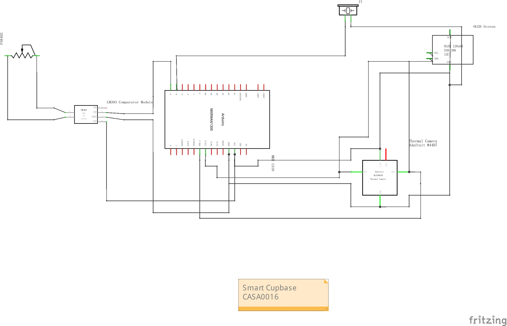

# Smart Cup Mat
**A Non-Intrusive Desktop Hydration Monitor & Temperature Assistant**

> **CASA0016 Coursework** | **Author:** Xinyuan Sun

---

## Repository Structure

```text
SmartCupMat/
├── src/                        # Arduino firmware source code (.ino)
├── 3Dmodels/                   # Enclosure design files
│   ├── Iteration_1/            # Initial design (Concept phase)
│   └── Iteration_2/            # Final design (with Load Transfer Pad)
├── bluescript/                 # Initial design sketches and concept art
├── resources/                  # Fritzing parts (.fzpz) and assets
├── Demo.mp4                    # Video demonstration of the prototype
├── circuitdiagram.png          # High-resolution connection schematic
└── README.md                   # Project documentation
```

##  Overview
**Smart Cup Mat** is an IoT device designed to improve office well-being by monitoring hydration habits and beverage temperature without altering user behavior.

Unlike intrusive smart bottles, this system uses a **sensor fusion approach**:
* **MLX90640 Thermal Camera:** Measures liquid temperature non-contact to prevent thermal injury.
* **FSR 402 Pressure Sensor:** Detects cup presence and tracks hydration intervals.

---

## Project Demo
Check out the device in action:

<video src="./Demo.mp4" controls="controls" style="max-width: 100%;">
  Your browser does not support the video tag.
</video>

*(If the video does not play, please [download it here](./Demo.mp4))*

---

##  System Architecture

The system operates on a **Finite State Machine (FSM)** logic to ensure reliable detection and low-latency feedback.

### 1. Logic Flow
The device transitions between **Idle**, **Timing** (Monitoring), and **Alert** states based on sensor inputs.
*(See report Figure 2 & 6 for detailed logic)*

### 2. Circuit Diagram
**Note:** The schematic below uses the **Arduino MKR WAN 1300** symbol for representation, as it is **pin-compatible** with the **MKR 1310** used in this project.



---

## Hardware & Enclosure

### Component List
* **Microcontroller:** Arduino MKR 1310
* **Thermal Sensor:** MLX90640 (32x24 IR Matrix)
* **Pressure Sensor:** FSR 402
* **Display:** 0.96" OLED (I2C)
* **Feedback:** Active Buzzer

### 3D Enclosure Design (Iterative Process)
The enclosure design is a critical part of this project, featuring a custom **Load Transfer Mechanism**.

* **`3Dmodels/Iteration_1` (Concept):** Initial design. Failed because concave mug bases bridged over the sensor, causing non-triggering issues.
* **`3Dmodels/Iteration_2` (Final):**
    * **Includes a "Load Transfer Pad":** A floating disk that bridges the sensor and the cup base.
    * **Result:** Ensures consistent pressure readings regardless of the cup's bottom shape (flat or concave).

---

##  Installation & Setup

### 1. Library Dependencies
Install the following libraries via Arduino IDE Library Manager:
* `Adafruit_MLX90640`
* `Adafruit_SSD1306`
* `Adafruit_GFX`

### 2. Uploading Firmware
1.  Open `src/SmartCupMat.ino`.
2.  Select board: **Arduino MKR WAN 1310**.
3.  Upload the code.

When debugging, please ensure your Serial Monitor is set to **115200 baud**.
> **Technical Note:** The MLX90640 requires high-speed data transfer. Setting the baud rate to 9600 (default) will cause buffer overflows and garbled data output.

```cpp
// Correct initialization in setup()
Serial.begin(115200);
```